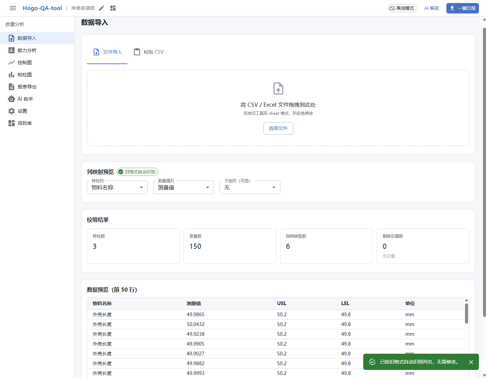
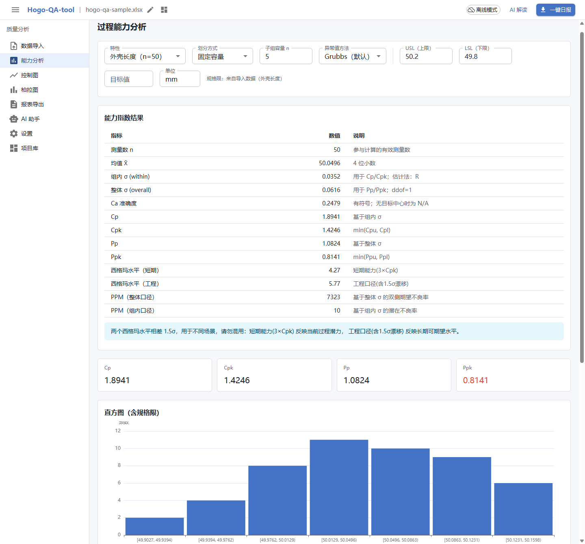
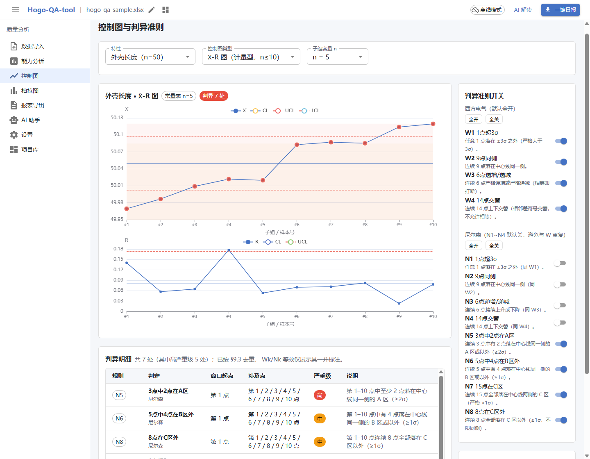
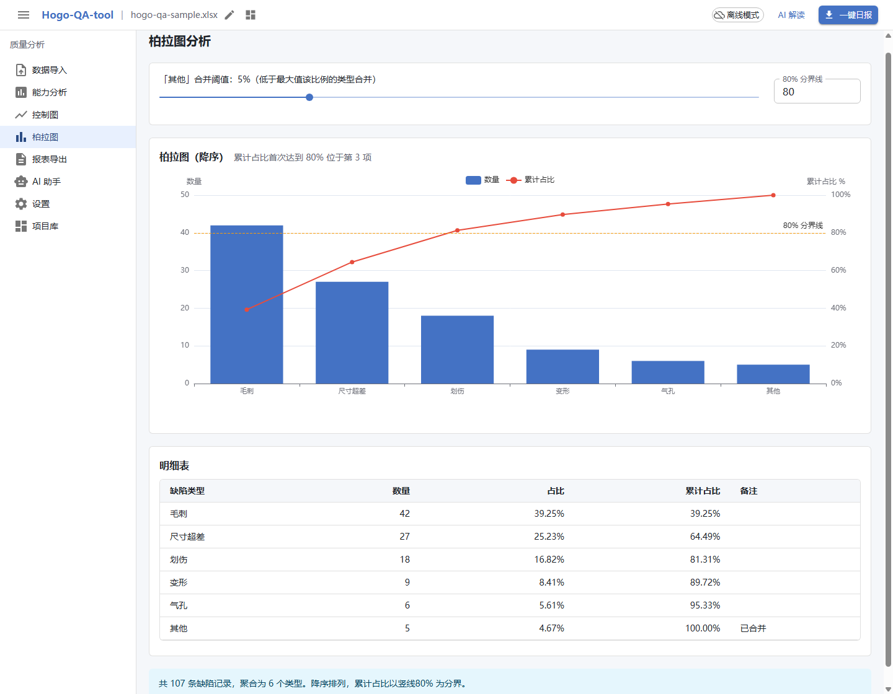
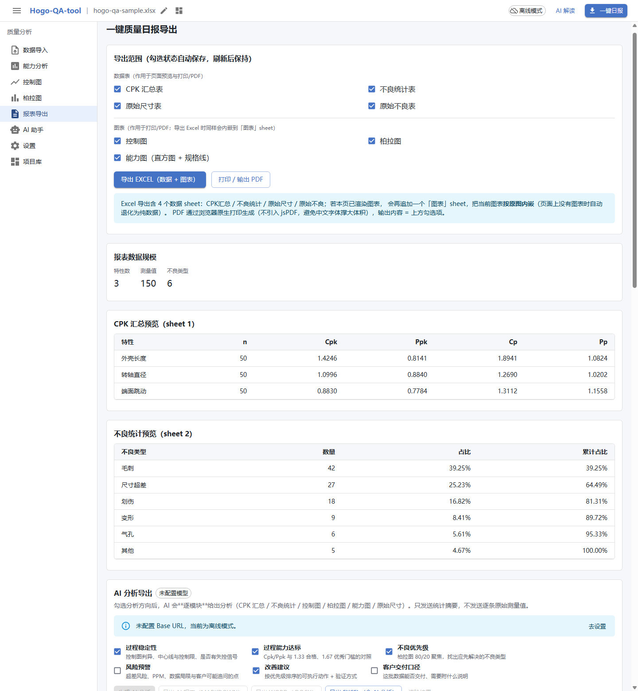
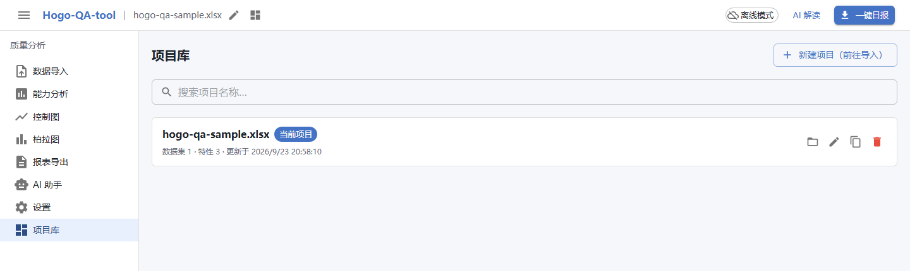

# Hogo-QA-tool

[](https://github.com/Hulk-Zhao/Hogo-QA-tool/actions/workflows/ci.yml) [](LICENSE)

给工厂质量人员的**离线 SPC 分析工具**：导入 Excel 测量值与不良数据，得到 Cp/Cpk/Pp/Ppk、控制图判异、
柏拉图与能力图，可打印 / 导出 Excel / Word，并可选用 AI 做解读。

- **纯离线**：构建产物是**单个 `index.html`**，双击即用。没有后端、没有数据库，**数据不出本机**。
- **统计学口径是对的**：Cp/Cpk 用组内 σ、Pp/Ppk 用整体 σ —— 修正了旧工具「Pp 恒等于 Cp」的缺陷（见下）。
- **AI 是可选项**：可接任意 OpenAI 兼容服务（DeepSeek、本机 Ollama…）。不配即为纯离线工具，功能一样不少。

## 界面

下面 6 张图都取自**真实构建产物** + 仓库自带的样本数据
（[`samples/hogo-qa-sample.xlsx`](samples/hogo-qa-sample.xlsx)），
由 `.probe/p13-readme-shots.mjs` 在真 Chrome 里自动拍摄 —— 不是手截的示意图，可自己复现。

**数据导入** —— 拖入旧工具格式的 xlsx，先给校验结果（特性 3 / 测量值 150 / 不良类型 6 / 空值 0），列名自动识别、可改。



**能力分析** —— Cp/Cpk 与 Pp/Ppk 并列（1.89/1.42 vs 1.08/0.81），直方图叠加规格限，双西格玛水平标注差异。



**控制图** —— Xbar-R 双图 + 分区带，违规点标红，右侧 12 条判异准则逐条开关，下方给出判异明细。



**柏拉图** —— 双 Y 轴、80% 分界线，一眼看出「毛刺 + 尺寸超差 + 划伤」三类占 81.31%。



**报表导出** —— 导出范围 7 项逐项勾选（数据表 4 + 图表 3），导出 Excel 时图表会内嵌进 `[图表]` sheet。



**项目库** —— 每次导入都会落盘成一个项目，刷新或重开后自动恢复上次项目。



## 快速开始

> 只有**构建**需要 Node ≥ 22.22.2（见 `.nvmrc` / `package.json` 的 `engines`）。
> 构建出来的 `dist/index.html` 是单文件，拷到任何机器上双击即可用，**目标机器不需要 Node**。

**第 1 步 · 取代码并安装依赖**（所有系统都一样）

```bash
git clone https://github.com/Hulk-Zhao/Hogo-QA-tool.git
cd Hogo-QA-tool
npm ci
```

**第 2 步 · 运行，三选一**

| 方式                           | 怎么做                                                                              | 适合                                                                                                                                   |
| ------------------------------ | ----------------------------------------------------------------------------------- | -------------------------------------------------------------------------------------------------------------------------------------- |
| **本地服务**<br>（功能最完整） | Windows：双击 `start.bat`<br>macOS / Linux：`npm run build:server && npm run serve` | 日常使用。IndexedDB 可用，**项目库能长期保存**                                                                                         |
| **单文件离线包**               | `npm run build`，然后双击 `dist/index.html`                                         | 拷给同事 / 放 U 盘。目标机器无需 Node，项目库照常保存（Chrome 上实测 `file://` 下 IndexedDB 可用，见 `.probe/p10-import-library.mjs`） |
| **开发模式**                   | `npm run dev` → http://localhost:5173/                                              | 改代码，热更新                                                                                                                         |

**常用命令**

```bash
npm test        # 全部单测
npm run verify  # typecheck + lint + 单测（提交前跑这个）
```

### 构建

| 命令                   | 产物              | 用途                           |
| ---------------------- | ----------------- | ------------------------------ |
| `npm run build`        | `dist/index.html` | **单文件离线版**，双击即可运行 |
| `npm run build:server` | `dist-server/`    | HTTP 服务版（支持 code-split） |

`npm run build` 产出的 `dist/index.html` 把 JS/CSS 全部内联，**双击就能用，目标机器不需要 Node**，
适合拷给同事、放 U 盘。**项目库在这两种形态下都能持久化** —— 离线包同样走 IndexedDB
（Chrome 上实测 `file://` 下 `indexedDB.open()` 成功，探针 `.probe/p13-file-idb.mjs`；
此前 README 写的「`file://` 禁用 IndexedDB」与实测不符）。但**连本机 AI 服务**（Ollama 之类）
必须用 `start.bat`：`file://` 页面直连 `localhost` 会被浏览器跨源策略拦下。

> `dist/` 不入库（见 `.gitignore`），所以**首次使用必须先自己构建一次**。
> 排障与设计细节见 [docs/03-构建与运行形态.md](docs/03-构建与运行形态.md)。

## 功能

| 模块         | 说明                                                                                                                                                                                                                        |
| ------------ | --------------------------------------------------------------------------------------------------------------------------------------------------------------------------------------------------------------------------- |
| **数据导入** | 旧工具 xlsx 双 sheet、CSV 长/宽表、粘贴导入；列名容错（大小写 / 全角 / 全角空格）；20 万条上限仅提示不截断                                                                                                                  |
| **能力分析** | Cp/Cpk/Pp/Ppk 双口径、双西格玛水平、正态性检验、异常值两步确认；规格限按特性自动预填；多特性 Cpk 汇总对比表                                                                                                                 |
| **控制图**   | Xbar-R / Xbar-S / I-MR / P / NP / C / U 七种，分区带、违规高亮、变限 P/U                                                                                                                                                    |
| **判异准则** | Western Electric W1–W4 + Nelson N1–N8，逐条开关（刷新后保持），去重与等效标注                                                                                                                                               |
| **柏拉图**   | 双 Y 轴、80% 分界线、悬浮显示频数与累计占比                                                                                                                                                                                 |
| **报表导出** | 导出范围 7 项逐项勾选；打印 / PDF 为 A4 光栅快照（光栅宽 2200px ÷ 186mm 可打印宽 ≈ **300 DPI**，单测契约 ≥ 250 DPI；图铺满可打印区）；Excel 含 4 个数据 sheet + 图表 sheet（内嵌 PNG）+ AI 分析 sheet                       |
| **AI 助手**  | 微信式对话视窗；OpenAI 兼容 API；默认只发统计摘要、不发原始测量值；一键全面诊断；**6 大类分析方向 × 6 个报表模块**的 AI 分析导出（Markdown / Excel / Word）；回复可**引用真实图表**（前端按你自己的数据现算，不是模型画图） |
| **项目库**   | 搜索 / 打开 / 重命名 / 复制 / 删除；刷新或重开后自动恢复上次项目（IndexedDB，降级 localStorage / 内存）                                                                                                                     |
| **设置**     | AI 配置与连通性测试、一键清除已保存配置、判异准则开关、常数表、AI 调用审计（跨会话保留）                                                                                                                                    |

## 样本数据与复算

仓库自带一份**合成**样本 [`samples/hogo-qa-sample.xlsx`](samples/hogo-qa-sample.xlsx)
（3 个特性 × 50 条测量值 + 6 类不良，与上面的截图是同一份数据）。
它是确定性生成的：`node samples/make-sample.mjs` 可以重新产出逐字节相同的文件。

下面所有数字都能用一条命令、通过**产品自己的统计内核**复算出来：

```bash
npm run sample:verify
```

它走的是界面同一条链路 —— `parseXlsx` → `buildModel` → `buildSubgroups` / `computeCapability` /
`buildControlChart` / `evaluateRules` / `buildPareto`，**没有第二份公式实现**。
样本被改动、或内核被改坏时这条命令会失败，所以下面这张表不会悄悄过期。

**1. 过程能力**（σ_within 走 R̄/d2，σ_overall 走样本标准差 ddof=1）

| 特性     |   n |    均值 | σ_within | σ_overall |   Cp |  Cpk |   Pp |  Ppk | 3×Cpk | 3×Cpk+1.5 | 判定                        |
| -------- | --: | ------: | -------: | --------: | ---: | ---: | ---: | ---: | ----: | --------: | --------------------------- |
| 外壳长度 |  50 | 50.0496 |  0.03520 |   0.06159 | 1.89 | 1.42 | 1.08 | 0.81 |  4.27 |      5.77 | 合格（≥1.33）               |
| 转轴直径 |  50 | 12.0027 |  0.00525 |   0.00653 | 1.27 | 1.10 | 1.02 | 0.88 |  3.30 |      4.80 | 偏低（1.00~1.33），建议改善 |
| 端面跳动 |  50 |  0.0598 |  0.00763 |   0.00865 | 1.31 | 0.88 | 1.16 | 0.78 |  2.65 |      4.15 | 不合格（<1.00），必须改善   |

三个特性刻意落在三档判定上。注意 `外壳长度` 的 **Cp 1.89 与 Pp 1.08 差了 43%** ——
σ_within 0.0352 与 σ_overall 0.0616 本来就是两个量，旧工具 `std_sub = std_total`
会让 Pp 恒等于 Cp，把这条信息抹平（见下节）。

**2. 控制图与判异**（Xbar-R，子组容量 5）

| 特性     | 子组数 | CL（X̄） |     UCL |     LCL |       R̄ | 命中规则       |
| -------- | -----: | ------: | ------: | ------: | ------: | -------------- |
| 外壳长度 |     10 | 50.0496 | 50.0968 | 50.0023 | 0.08187 | N5、N6、N8、W1 |
| 转轴直径 |     10 | 12.0027 | 12.0097 | 11.9956 | 0.01222 | N5、W1         |
| 端面跳动 |     10 |  0.0598 |  0.0700 |  0.0496 | 0.01774 | W1             |

样本里人为埋了「整段均值阶跃 / 单点尖峰 / 连续上升」三种异常，
所以判异不是空转 —— 界面上这些点会被标红并逐条给出窗口起点与涉及点。

**3. 柏拉图**（合成不良数据）

| 排名 | 不良类型 | 数量 |  占比 | 累计占比 |
| ---: | -------- | ---: | ----: | -------: |
|    1 | 毛刺     |   42 | 39.3% |   39.25% |
|    2 | 尺寸超差 |   27 | 25.2% |   64.49% |
|    3 | 划伤     |   18 | 16.8% |   81.31% |
|    4 | 变形     |    9 |  8.4% |   89.72% |
|    5 | 气孔     |    6 |  5.6% |   95.33% |
|    6 | 其他     |    5 |  4.7% |  100.00% |

前 3 类累计 81.31%，第 3 项越过 80% 分界线。

## 核心差异化：双西格玛口径

旧版 Python 工具里 `spc.py` 有一处缺陷：`std_sub = std_total`，**未做子组分组**，导致
**Pp 恒等于 Cp** —— 组内变异与整体变异无法区分，能力指数不可信。本工具按标准口径拆开：

| 指数     | σ 口径                         | 含义             |
| -------- | ------------------------------ | ---------------- |
| Cp / Cpk | σ_within（组内：R̄/d2 或 S̄/c4） | 过程**潜在**能力 |
| Pp / Ppk | σ_overall（整体，ddof=1）      | 过程**实际**表现 |

同时展示**双西格玛水平**（短期 3×Cpk vs 工程口径 3×Cpk+1.5）并标注差异，避免两者混用造成误判。

## 技术栈与架构

Vite 5 · React 18 · TypeScript 5 · MUI 5 · Tailwind 3 · zustand 4 · ECharts 5 · SheetJS 0.18 · idb 8 · vitest 2

```
core（纯函数内核）→ data（导入/导出/持久化）→ services（业务编排）→ ui / store
```

`src/core/**` 通过 ESLint `no-restricted-imports` **强制零 React / DOM 依赖**，
保证统计公式可在 node 环境被独立验证 —— 这是整个项目可验证性的基石。

## 安全与数据主权

本工具默认离线、数据不出本机，但有三处**已知边界**需要知情：

1. **API Key 以明文存于本机浏览器**。`file://` 形态下没有可用的加密后端，密钥只能明文写入
   `localStorage["hogo-qa-settings"]`。影响面仅本机浏览器配置目录；工具**不会**把密钥发往任何
   非用户配置的地址。「设置」页有「清除已保存的 AI 配置」可一键擦除。
2. **xlsx@0.18.5 的原型污染风险（CVE-2023-30533）**。SheetJS 0.18.5 是 npm 上可安装的最后一个版本，
   因此导入器在**出口**做了独立于版本的防护：解析前后对比 `Object.prototype` 并清除注入属性（同时给出告警），
   单元格只放行 `string | number | null`。中期计划评估迁移到 `exceljs`。
3. **AI 默认只发送统计摘要，绝不包含逐条原始测量值**。发送原始数据需显式勾选并二次确认，
   每次请求的实际字段以气泡上的「发送字段」清单为准（由构造请求的同一份白名单直接产出）。

<details>
<summary>本机存储键清单（便于审计与手工清理）</summary>

| localStorage 键         | 内容                                   |
| ----------------------- | -------------------------------------- |
| `hogo-qa-settings`      | AI 配置（含明文 API Key）              |
| `hogo-qa-preferences`   | 判异准则 12 条开关 + 报表导出范围 7 项 |
| `hogo-qa-diagnosis`     | AI 全面诊断报告（最新一份）            |
| `hogo-qa-ai-usage-logs` | AI 调用审计记录（最多 500 条）         |
| `hogo-qa-last-project`  | 上次保存 / 打开的项目 id               |

项目实体与测量值不在上述键中：走 IndexedDB（库名 `hogo-qa-tool`，对象存储 `projects` / `measurements`），不可用时降级
localStorage，再不可用则仅内存（UI 会提示导出 JSON）。

</details>

## 文档

| 文件                                                           | 内容                                           |
| -------------------------------------------------------------- | ---------------------------------------------- |
| [docs/PRD_v1.0.md](docs/PRD_v1.0.md)                           | 产品需求文档                                   |
| [docs/system_design.md](docs/system_design.md)                 | 系统架构设计（含统计公式与判异算法定义）       |
| [docs/00-范围决策与调研结论.md](docs/00-范围决策与调研结论.md) | 范围决策、旧工具缺陷、行业调研                 |
| [docs/01-基准数据与验证口径.md](docs/01-基准数据与验证口径.md) | 回归基准值与验收口径                           |
| [docs/02-AI接入与排障.md](docs/02-AI接入与排障.md)             | AI 接入步骤、报错对照表、对话与图表引用行为    |
| [docs/03-构建与运行形态.md](docs/03-构建与运行形态.md)         | 离线/HTTP 两种形态的差异与原因、开发约定与门禁 |
| [CONTRIBUTING.md](CONTRIBUTING.md)                             | 贡献指南（开发环境、门禁、代码约定）           |
| [.probe/README.md](.probe/README.md)                           | 真机验收脚本怎么跑（含真 LLM 探针）            |

## 开源与协作

- **许可证**：[MIT](LICENSE)。
- **贡献**：见 [CONTRIBUTING.md](CONTRIBUTING.md)。提交前请跑 `npm run verify` 与 `npm run build`。
- **CI**：[.github/workflows/ci.yml](.github/workflows/ci.yml) 在 Node 24 上跑类型 / 静态检查 / 单测 / 两种构建。
- **测试用的基准数据**：需要真实 xlsx 的用例默认读仓库内 fixture
  （`src/data/__tests__/fixtures/quality_data.xlsx`，纯合成数据）。想换成自己的文件：
  `HOGO_REAL_XLSX=/path/to/quality_data.xlsx npm test`；两者都没有时这几组用例**整体 skip**（不会红）。
