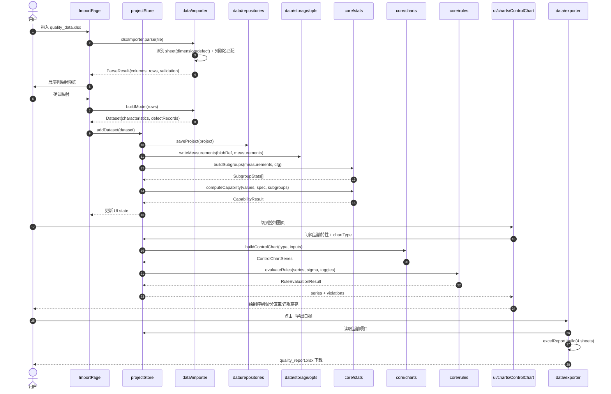
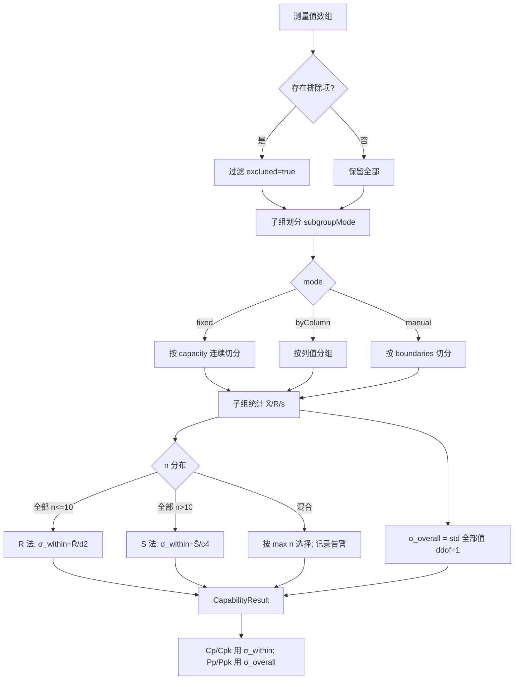
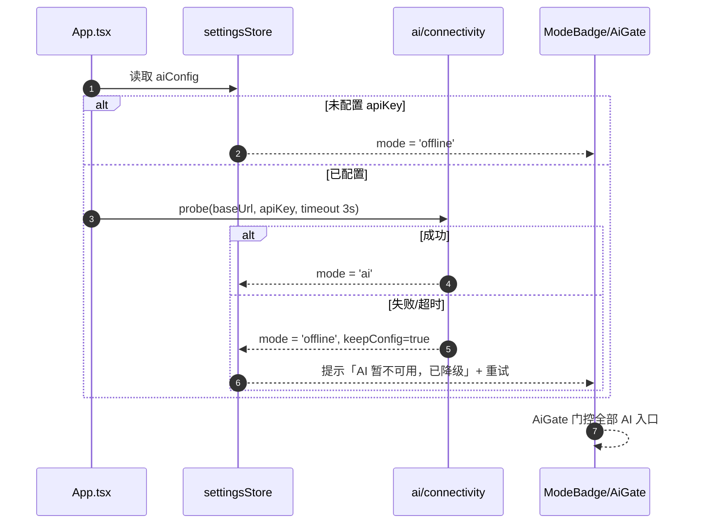
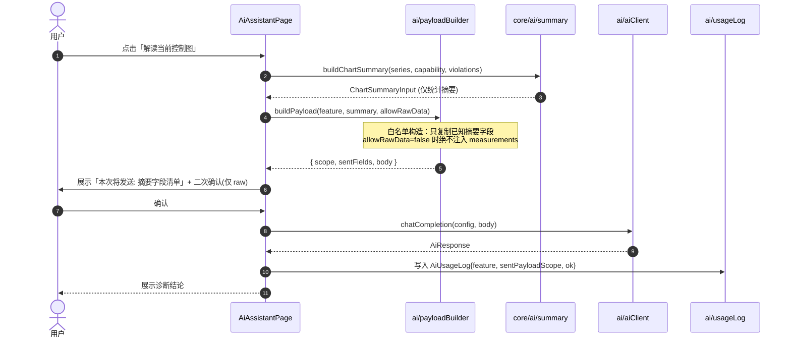
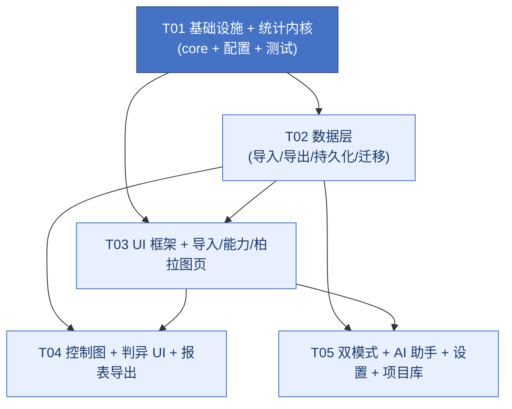

# Hogo-QA-tool 系统设计与任务分解

> 文档性质：架构师（高见远）给工程团队的实施规格书。全中文；代码标识符用英文。
> 上游输入：`docs/PRD_v1.0.md`、`docs/00-范围决策与调研结论.md`、`docs/01-基准数据与验证口径.md`、旧工具源码 `E:\tools\品质工具\pqe_tool\`。
> 本文档同时作为 QA（独立验证统计正确性）与工程师（批量实现）的共同基线。

---

## 0. 设计总览与关键判断

| 项 | 结论 |
|---|---|
| 形态 | 单代码库，静态站点，双模式（离线 / AI）运行时探测 |
| 分层 | `core`（纯函数统计内核，零 UI/浏览器依赖）→ `data`（持久化/导入导出）→ `services`（AI/报告）→ `ui`（React+MUI）|
| 最重要约束 | **`src/core/` 不得 import 任何 React/MUI/DOM/浏览器 API**，可在 Node 下直接 `vitest` 跑；这是 QA 独立验证公式的前提 |
| 正确性底线 | 组内 σ 与整体 σ 分离；常数表 n=2..25 逐项自检；判异准则 12 条精确到边界 |
| 交付 | `npm run build` 产出可离线打开的静态站点；无后端 |

### 0.1 我对主理人技术决策的确认与两点补充

主理人的技术决策我**全部采纳**，仅补充两点（非推翻，属于增强）：

1. **持久化补一层 `Repository` 抽象接口**。IndexedDB + OPFS 在部分浏览器/隐私模式下不可用，因此 `data/repositories/` 定义接口，实现层提供 `IdbRepository`（首选）与 `MemoryRepository`（降级，内存 + Blob 导出）。这样核心业务代码不感知存储介质。
2. **`strict ratio` 处理**：OPFS 用 `navigator.storage.getDirectory()`；不支持时降级为「测量值以内联数组存入 IndexedDB」。该降级由 `hasOpfs()` 能力探测决定，见 §7。

### 0.2 已拍板决策（v1.1 更新，覆盖原 §9 待明确事项）

> 以下为 team-lead 2026 复审确认的最终口径，**本文档所有相关段落已据此更新**，Engineer/QA 按此实现与验证。

| # | 事项 | 最终口径 |
|---|---|---|
| 1 | Excel 日报是否内嵌图片 | **不内嵌**。Excel 只出数据 sheet（≥4 个：CPK汇总/不良统计/原始尺寸/原始不良）；控制图与柏拉图截图**随浏览器打印样式 PDF 输出**。不引入 SheetJS 付费版，不手写 OOXML 塞图片。 |
| 2 | 中心线上点的判异边界 | 维持裁定：**等于 CL 的点打断同侧/递增/递减/交替序列**（Minitab 惯例，`EQUAL_EPS=1e-9`）。`rules.spec.ts` 按此口径断言。 |
| 3 | 异常值识别默认方法 | 默认 **`grubbs`**，保留 `iqr` 切换，**两种都实现**。 |
| 4 | API Key 存储 | localStorage 明文，**不加加密**（单机单用户场景）。设置页提示 Key 存于本机浏览器。 |
| 5 | CSV 导入主形态 | 默认按**长表**（一行一测量值）引导；宽表（一行一子组）同样支持。 |
| 6 | σ 混合子组容量 | 按 `max(n)` 选 R/S 法并加告警（`MIXED_SUBGROUP_SIZE`）。 |
| 7 | PPM 非正态数据 | 正态假设 + 告警文案，Box-Cox 列 P2。 |
| 8 | 登录 / 多用户 | 单机单用户，**无账号体系**。 |
| 9 | 性能上限 | 首期支持 ≤ **20 万测量值**；超过时提示并建议分批导入。 |
| 10 | **常数表无定义值表示（新增）** | D3/B3 等小样本「无定义」的常数**返回 `null`**（**不用 0**），避免下控制限被误画成「0 线」。判断逻辑见 §10.6 与 §10.7。 |
| 11 | **回归基准断言位置（新增）** | `capability.spec.ts` 断言基准数据 **Ppk 与 `docs/01-基准数据与验证口径.md` 的 Cpk 吻合（≤0.001）**，注明「**未剔除异常值**」前提；Cp/Cpk 因组内 σ 口径不同允许不等。 |

---

# Part A：系统设计

## 1. 实现方案与框架选型

### 1.1 核心难点分析

| 难点 | 说明 | 对策 |
|---|---|---|
| D1 统计正确性 | 组内 σ vs 整体 σ 分离、常数表、12 条判异准则、正态性检验 | 纯函数内核 + 逐项单元测试；常数表独立数据模块 + 自检用例 |
| D2 大文件离线 | 150 行/50 元素示例小，但现场可上万行 | OPFS 存测量值；IndexedDB 存元数据；能力探测失败则降级 |
| D3 控制图渲染 | 需要控制限虚线、±1σ/±2σ 分区带、违规点高亮、点击定位 | ECharts 自定义 series（line + markLine + markArea + effectScatter） |
| D4 旧格式兼容 | `dimension`/`defect` 双 sheet，列名中文固定 | 列映射层 + 别名表，无法匹配时进入人工映射 UI |
| D5 双模式无感切换 | 启动探测 AI，不可用自动降级，功能不残缺 | `AiProviderContext` + 连通性探测；AI 入口统一走 `AiGate` 组件 |
| D6 数据主权 | 默认只发摘要，技术层面保证不误发明细 | `buildAiPayload()` 白名单构造，明细字段须显式开关才注入 |

### 1.2 框架与库选型

| 领域 | 选型 | 理由 |
|---|---|---|
| 构建 | Vite 5 + TypeScript 5 | 静态站点、秒级热更新、产物可离线打开 |
| UI | React 18 + MUI 5 + Tailwind CSS 3 | MUI 保证表格/表单/对话框质量；Tailwind 负责布局与打印样式微调 |
| 路由 | react-router-dom 6 | 页面级路由，配合左侧导航 |
| 图表 | echarts 5 + echarts-for-react | 控制图分区带/控制限/高亮定制能力强，社区成熟 |
| Excel | xlsx (SheetJS) 0.20 | 读写 xlsx/csv；旧工具兼容 |
| 状态 | zustand 4 | 轻量、无 Provider 地狱、可在 store 内调用 core 纯函数；比 Redux 简单，比 Context 性能好 |
| 持久化 | 原生 IndexedDB（`idb` 6 封装）+ OPFS | `idb` 提供 Promise 化 API；OPFS 存大数组 |
| 测试 | vitest 2 | 与 Vite 同源；`environment: 'node'` 下跑 core 单元测试 |
| 日期 | dayjs 1 | 轻量 |
| AI | 原生 fetch（OpenAI 兼容 REST） | 无后端，直连用户配置端点；不引入 SDK 减少体积 |

**不引入**：jsPDF（主理人已拍板，用浏览器打印样式）、SheetJS 付费版（Excel 只出数据 sheet，**不内嵌图片**，见 §0.2 #1）、任何服务端框架、任何统计库（statsmodels/jstat — 自研以获得可验证性，且避免 wasm 体积）。

### 1.3 架构模式

采用**分层架构 + 单向数据流**：

```
ui (React/MUI) ──调用──> store (zustand) ──调用──> core (纯函数)
       ▲                                             │
       └──────────── 订阅 state ────────────────────┘
ui ──> data (repository / importer / exporter) ──> core / IndexedDB / OPFS
ui ──> services (ai / report) ──> core 摘要 + fetch
```

- **core 层**：只做数学，输入纯数据、输出纯数据，无副作用。
- **store 层**：持有当前项目状态，动作中调用 core 得到结果，是 core 与 ui 的唯一桥梁。
- **data 层**：导入导出与持久化，不参与计算。
- **services 层**：AI 与报表，依赖 core 的摘要输出与 store 的当前状态。

---

## 2. 完整文件列表（相对路径，精确到文件名）

> 根目录：`E:\tools\Hogo-QA-tool\`

### 2.1 根配置

```
package.json
package-lock.json
tsconfig.json
tsconfig.node.json
vite.config.ts
tailwind.config.ts
postcss.config.js
index.html
.eslintrc.cjs
.prettierrc
vitest.config.ts
README.md
.gitignore
```

### 2.2 public（静态资源）

```
public/favicon.svg
public/logo.svg
```

### 2.3 src 入口与全局

```
src/main.tsx
src/App.tsx
src/vite-env.d.ts
src/index.css
src/print.css                        # 打印/PDF 原生样式
src/theme.ts                         # MUI 主题（与 Tailwind 变量对齐）
```

### 2.4 src/core —— 纯统计内核（禁止依赖 React/DOM）

```
src/core/types.ts                    # 内核全部类型定义（唯一权威）
src/core/constants/index.ts          # 导出全部常数表入口
src/core/constants/controlChartConstants.ts   # A2/A3/D3/D4/B3/B4/d2/E2/c4 (n=2..25)
src/core/constants/distributionTables.ts      # t 分布/正态 CDF 等查表与近似
src/core/constants/ruleMeta.ts       # 12 条判异准则元数据（编号/名称/来源/默认开关）

src/core/stats/descriptive.ts        # 均值/标准差(ddof)/极差/中位数/偏度/峰度
src/core/stats/specLimits.ts         # 规格限有效性判定
src/core/stats/subgrouping.ts        # 三种子组划分模式
src/core/stats/capability.ts         # Ca/Cp/Cpk/Pp/Ppk/西格玛水平/PPM
src/core/stats/outliers.ts           # Grubbs / 1.5IQR 异常值识别
src/core/stats/histogram.ts          # Sturges 分箱 + 频数

src/core/charts/controlChart.ts      # 7 种控制图控制限计算（含变限 P/U）
src/core/charts/xbarR.ts
src/core/charts/xbarS.ts
src/core/charts/imr.ts
src/core/charts/attributes.ts        # P / NP / C / U 计数型
src/core/charts/chartFactory.ts      # 按类型分发到具体实现

src/core/rules/types.ts              # 判异规则内部类型
src/core/rules/westernElectric.ts    # 西方电气 4 条
src/core/rules/nelson.ts             # 尼尔森 8 条
src/core/rules/index.ts              # 合并、去重、逐条开关、违规聚合

src/core/normality/andersonDarling.ts
src/core/normality/shapiroWilk.ts
src/core/normality/index.ts          # 统一入口 + 结论文案判定

src/core/pareto/pareto.ts            # 柏拉图聚合与累计占比

src/core/ai/summary.ts               # 纯函数：由分析结果构造「可发送摘要」（供 services 用）

src/core/math/normalCdf.ts           # 标准正态 CDF/PDF 近似（Abramowitz-Stegun）
src/core/math/matrix.ts              # Shapiro-Wilk 需要的多项式与辅助

src/core/__tests__/constants.spec.ts         # 常数表自检（n=2..25 全覆盖）★QA 核心
src/core/__tests__/capability.spec.ts
src/core/__tests__/subgrouping.spec.ts
src/core/__tests__/controlChart.spec.ts
src/core/__tests__/rules.spec.ts
src/core/__tests__/normality.spec.ts
src/core/__tests__/outliers.spec.ts
src/core/__tests__/outliers.spec.ts
src/core/__tests__/pareto.spec.ts
src/core/__tests__/fixtures/sampleDimension.ts   # 由基准数据构造的固定 fixture
src/core/__tests__/fixtures/sampleDefect.ts
```

### 2.5 src/data —— 持久化与导入导出

```
src/data/schema.ts                   # 领域实体类型（Project/Dataset/... 与 core 类型衔接）
src/data/schemaVersion.ts            # 当前版本号 + 迁移入口
src/data/migrations/index.ts         # migrateProject(raw): Project
src/data/migrations/v1_to_v2.ts      # 示例骨架（首期仅 v1，保留结构）

src/data/repositories/types.ts       # ProjectRepository 接口
src/data/repositories/idbRepository.ts
src/data/repositories/memoryRepository.ts
src/data/repositories/index.ts       # createRepository() 能力探测

src/data/storage/opfsStore.ts        # OPFS 读写 + hasOpfs()
src/data/storage/blobFallback.ts     # Blob 下载/上传降级

src/data/importer/types.ts
src/data/importer/columnAliases.ts   # 旧工具列名别名表
src/data/importer/xlsxImporter.ts    # 双 sheet 解析
src/data/importer/csvImporter.ts     # 长表/宽表 CSV
src/data/importer/clipboardImporter.ts
src/data/importer/buildModel.ts      # 解析结果 → Dataset/Characteristic/Subgroup

src/data/exporter/projectPackage.ts   # JSON 项目包导入导出
src/data/exporter/excelReport.ts      # 4 sheet 日报导出
src/data/exporter/reportModel.ts      # 报表中间模型
```

### 2.6 src/services —— AI 与报告

```
src/services/ai/types.ts
src/services/ai/aiClient.ts          # OpenAI 兼容 REST 封装
src/services/ai/connectivity.ts      # 连通性探测（3s 超时）
src/services/ai/payloadBuilder.ts    # 白名单构造请求体（隐私边界）
src/services/ai/prompts.ts           # 各功能 prompt 模板
src/services/ai/aiService.ts         # 对外统一方法（5 个功能）
src/services/ai/usageLog.ts          # AiUsageLog 记录

src/services/report/markdownReport.ts  # P1 Markdown 报告文字
src/services/report/printService.ts    # 触发浏览器打印
```

### 2.7 src/store —— 状态管理

```
src/store/projectStore.ts            # 当前项目/数据集/特性/选择
src/store/analysisStore.ts           # 分析配置与分析结果缓存
src/store/settingsStore.ts           # AI 配置、规则默认开关、主题
src/store/uiStore.ts                 # 导航、加载态、Toast
src/store/selectors.ts               # 派生选择器（含 memo 计算入口）
```

### 2.8 src/ui —— React 组件

```
src/ui/layout/AppShell.tsx           # 左导航 + 顶栏 + 内容区
src/ui/layout/Sidebar.tsx
src/ui/layout/TopBar.tsx             # 项目名 + 模式徽标 + 一键日报
src/ui/layout/ProjectSwitcher.tsx

src/ui/components/ModeBadge.tsx      # 离线/AI 徽标
src/ui/components/AiGate.tsx         # AI 入口统一门控
src/ui/components/DataTable.tsx      # 通用表格
src/ui/components/StatCard.tsx
src/ui/components/EmptyState.tsx
src/ui/components/ConfirmDialog.tsx
src/ui/components/ErrorBoundary.tsx
src/ui/components/NumberCell.tsx     # 数值格式化（精度约定）

src/ui/charts/ControlChart.tsx       # ECharts 控制图封装
src/ui/charts/HistogramChart.tsx
src/ui/charts/ParetoChart.tsx
src/ui/charts/RuleViolationTable.tsx

src/ui/pages/ImportPage.tsx
src/ui/pages/CapabilityPage.tsx
src/ui/pages/ControlChartPage.tsx
src/ui/pages/ParetoPage.tsx
src/ui/pages/ReportPage.tsx
src/ui/pages/AiAssistantPage.tsx
src/ui/pages/SettingsPage.tsx
src/ui/pages/ProjectLibraryPage.tsx  # P1

src/ui/hooks/useCapabilityAnalysis.ts
src/ui/hooks/useControlChart.ts
src/ui/hooks/useAiAvailability.ts
src/ui/hooks/useProjectPersistence.ts
```

### 2.9 目录结构总览

```
src/
├── core/        # 纯函数，零 UI 依赖 ★
├── data/        # 导入导出、持久化
├── services/    # AI、报表
├── store/       # zustand
└── ui/          # React 组件与页面
```

**边界规则（ESLint 强制）**：`src/core/**` 禁止 import `react`、`@mui/*`、`zustand`、`../data/**`、`../services/**`、`../store/**`、`../ui/**`；禁止使用 `window`/`document`/`navigator`/`FileReader`/`localStorage`。用 `eslint-plugin-boundaries` 或 `no-restricted-imports` 落地。

---

## 3. 数据结构与接口定义（TypeScript）

### 3.1 内核类型（`src/core/types.ts`，唯一权威）

```typescript
// ---------- 基础 ----------
export type NumericArray = number[];

/** 规格限；null 表示未提供（单侧规格场景） */
export interface SpecLimits {
  usl: number | null;
  lsl: number | null;
  target: number | null;
  unit: string;
}

/** 单条测量记录（内核视角，非持久化实体） */
export interface MeasurementInput {
  id: string;
  value: number;
  subgroupId?: string;      // 预分组时提供
  excluded?: boolean;       // 已确认排除
}

/** 子组划分模式 */
export type SubgroupMode = 'fixed' | 'byColumn' | 'manual';

export interface SubgroupConfig {
  mode: SubgroupMode;
  capacity?: number;                 // fixed 模式必填，n>=2 整数
  columnValues?: string[];           // byColumn：与测量值一一对应的分组键
  manualBoundaries?: number[];       // manual：子组起始索引（升序）
}

/** 计算得到的子组统计（内核输出） */
export interface SubgroupStats {
  id: string;
  index: number;         // 从 0 开始
  size: number;          // n
  values: number[];      // 参与计算的（未排除）值
  mean: number;          // X̄_i
  range: number;         // R_i = max - min
  std: number;           // s_i (ddof=1, n>=2)
}

/** 标准差双口径 */
export type SigmaMode = 'R' | 'S';

export interface SigmaEstimate {
  mode: SigmaMode | 'IMR' | 'OVERALL';
  within: number;            // σ_within
  overall: number;           // σ_overall (ddof=1)
  rBar?: number;             // R̄（R 法）
  sBar?: number;             // S̄（S 法）
  mrBar?: number;            // MR̄（I-MR）
  basis: 'R' | 'S' | 'IMR';  // 实际采用哪种估计组内 σ
}

/** 能力指数结果 */
export interface CapabilityResult {
  n: number;                 // 有效测量数
  mean: number;
  sigma: SigmaEstimate;
  spec: SpecLimits;

  ca: number | null;         // 准确度
  cp: number | null;         // 单侧规格时 null
  cpk: number | null;
  cpu: number | null;
  cpl: number | null;
  pp: number | null;
  ppk: number | null;
  ppu: number | null;
  ppl: number | null;

  sigmaLevelShort: number | null;   // 3 * Cpk
  sigmaLevelBench: number | null;   // 3 * Cpk + 1.5

  ppmOverall: number | null;        // 基于 σ_overall 的双侧期望 PPM
  ppmWithin: number | null;         // 基于 σ_within 的潜在 PPM

  warnings: CapabilityWarning[];    // 如「无子组结构，Cp/Cpk 不可计算」
}

export type CapabilityWarning =
  | 'NO_SUBGROUP_STRUCTURE'
  | 'ONLY_ONE_SIDED_SPEC'
  | 'SIGMA_WITHIN_ZERO'
  | 'NON_NORMAL_DATA'
  | 'MIXED_SUBGROUP_SIZE'      // 子组容量不一致，按 max(n) 选 R/S 法
  | 'INSUFFICIENT_SAMPLE';
```

### 3.2 控制图类型

```typescript
export type ChartType =
  | 'Xbar-R' | 'Xbar-S' | 'I-MR'
  | 'P' | 'NP' | 'C' | 'U';

/** 单个数据点的图坐标（含变限） */
export interface ChartPoint {
  index: number;             // 0-based
  xLabel: string;            // 子组号 / 样本号 / 批次
  value: number;             // 主图绘制值（X̄ / I / p̂ / ...）
  subgroupId?: string;
  subgroupSize: number;      // 用于变限
}

/** 一条控制限序列（变限时为逐点不同） */
export interface ControlLine {
  label: string;                       // 'CL' | 'UCL' | 'LCL'
  values: number[];                    // 与 points 等长
  isConstant: boolean;                 // 恒定限为 true（图示可简化）
}

export interface ControlChartSeries {
  /** 主图（Xbar / I / P / NP / C / U） */
  primary: {
    name: string;                      // 'X̄' | 'I' | 'p' | ...
    points: ChartPoint[];
  };
  /** 副图（R / S / MR），I-MR 与计量型有，计数型无 */
  secondary?: {
    name: string;                      // 'R' | 'S' | 'MR'
    points: ChartPoint[];
  };
  limits: {
    primary: ControlLine[];
    secondary?: ControlLine[];
  };
  sigmaZones?: {                       // 计量型主图才有（相对 CL 的 ±1σ/±2σ）
    centerLine: number;
    oneSigma: number;                  // σ̂（用于画分区带）
    // 分区带实际由 UI 依据 centerLine ± k*oneSigma 绘制
  };
  constantsUsed: Partial<ControlChartConstants> & { n: number };
  selectedType: ChartType;
}

export interface ControlChartConstants {
  n: number;
  A2: number; A3: number;
  D3: number | null;   // n<=6 无定义 → null（禁止用 0）
  D4: number;
  B3: number | null;   // n<=5 无定义 → null（禁止用 0）
  B4: number;
  d2: number; E2: number; c4: number;
}

/** 计数型输入 */
export interface AttributeInput {
  /** 每个样本：不良数（P/NP 用）或缺陷数（C/U 用） */
  defectivesOrDefects: number[];
  /** 每个样本的样本量；NP/C 需恒定 */
  sampleSizes: number[];
}
```

### 3.3 判异规则类型

```typescript
export type RuleGroup = 'westernElectric' | 'nelson';

export type NelsonRuleId =
  | 'N1' | 'N2' | 'N3' | 'N4' | 'N5'
  | 'N6' | 'N7' | 'N8';

export type WesternRuleId = 'W1' | 'W2' | 'W3' | 'W4';

export type RuleId = WesternRuleId | NelsonRuleId;

/** 单条规则的元数据 */
export interface RuleMeta {
  id: RuleId;
  group: RuleGroup;
  shortName: string;         // '1点超3σ'
  description: string;       // 完整中文说明
  source: 'Western Electric 1956' | 'Nelson 1984 JQT';
}

/** 规则判定的通用上下文 */
export interface RuleContext {
  /** 主图数值序列（X̄ / I / p̂ / c / u / np），已按原始顺序 */
  values: number[];
  /** 中心线 CL（计量型为 X̄，计数型为 p̄/c̄/ū/np̄） */
  centerLine: number;
  /** 用于判定 σ 区的标准差（计量型：σ_within 估计值；I-MR：MR̄/d2(n=2)） */
  sigma: number;
  /** 每条点对应的子组容量（变限 P/U 用，判定阈值不变时可为常数） */
  subgroupSizes: number[];
}

/** 一次判异命中 */
export interface RuleViolation {
  ruleId: RuleId;
  ruleGroup: RuleGroup;
  /** 违规涉及的点索引（升序，长度 >=1；区间型规则给全部涉及点） */
  pointIndices: number[];
  /** 触发该违规的「窗口起点」——列表展示与图上定位用 */
  windowStart: number;
  /** 人类可读描述，如「第 12–20 点连续 9 点在中心线上方」 */
  message: string;
  severity: 'high' | 'medium' | 'low';
}

export interface RuleEvaluationResult {
  violations: RuleViolation[];
  /** 每个点被命中的规则集合，供图上高亮 */
  pointRuleMap: Record<number, RuleId[]>;
  /** 实际启用的规则 id */
  enabledRules: RuleId[];
}

export interface RuleToggleConfig {
  westernElectric: Record<WesternRuleId, boolean>;
  nelson: Record<NelsonRuleId, boolean>;
}
```

### 3.4 正态性检验类型

```typescript
export interface NormalityResult {
  method: 'AD' | 'SW';
  statistic: number;
  pValue: number;                 // 近似 p 值；无法给精确 p 时给等价判定
  isNormal: boolean;              // pValue >= 0.05
  /** 当 n 或条件超出方法适用范围时给出 */
  note?: string;
  /** 两种方法都给，UI 优先展示 S-W（n<=50） */
  companion?: {
    method: 'AD' | 'SW';
    statistic: number;
    pValue: number;
  };
}
```

### 3.5 直方图与柏拉图

```typescript
export interface HistogramResult {
  bins: { x0: number; x1: number; count: number; label: string }[];
  binWidth: number;
  binCount: number;
  rule: 'sturges' | number;
}

export interface ParetoItem {
  defectType: string;
  count: number;
  ratio: number;          // 占比 %
  cumRatio: number;       // 累计占比 %
  isOther: boolean;
}

export interface ParetoResult {
  items: ParetoItem[];        // 降序
  total: number;
  crossingIndex: number | null;  // 累计首次 >= 阈值（默认 80）的项索引
  threshold: number;             // 默认 80
}
```

### 3.6 领域实体（`src/data/schema.ts`）

```typescript
export const CURRENT_SCHEMA_VERSION = 1;

export interface Project {
  id: string;
  name: string;
  description: string;
  createdAt: string;      // ISO 8601 UTC
  updatedAt: string;
  schemaVersion: number;
  datasets: Dataset[];
  analysisConfigs: AnalysisConfig[];
  aiUsageLogs: AiUsageLog[];
}

export interface Dataset {
  id: string;
  projectId: string;
  name: string;
  sourceType: 'xlsx' | 'csv' | 'json';
  importedAt: string;
  rawFileName: string;
  characteristics: Characteristic[];
  defectRecords: DefectRecord[];
}

export interface Characteristic {
  id: string;
  datasetId: string;
  name: string;                 // 原「物料名称」
  specLimits: SpecLimits;
  measurements: Measurement[];
  subgroups: PersistedSubgroup[];
  nullCount: number;
  outlierFlags: OutlierFlag[];
  preprocessConfigRef: string | null;
  /** OPFS 引用；为空时 measurements 内联 */
  measurementBlobRef: string | null;
}

export interface Measurement {
  id: string;
  characteristicId: string;
  value: number;
  subgroupId: string | null;
  timestamp: string | null;     // ISO 8601
  batch: string | null;
  excluded: boolean;
  excludeReason: string | null;
}

export interface PersistedSubgroup {
  id: string;
  characteristicId: string;
  index: number;
  size: number;
  measurementIds: string[];
  mean: number;
  range: number;
  std: number;
}

export interface OutlierFlag {
  measurementId: string;
  method: 'grubbs' | 'iqr';
  statistic: number;
  threshold: number;
  confirmed: boolean;           // 是否被用户确认排除
}

export interface DefectRecord {
  id: string;
  datasetId: string;
  defectType: string;
  count: number;
  category: string | null;
}

export interface AnalysisConfig {
  id: string;
  projectId: string;
  name: string;
  subgroupCapacity: number;                 // default 5
  subgroupMode: SubgroupMode;
  sigmaMode: SigmaMode;
  outlierMethod: 'grubbs' | 'iqr';
  outlierConfirmedIds: string[];
  weRules: Record<WesternRuleId, boolean>;
  nelsonRules: Record<NelsonRuleId, boolean>;
}

export interface AiUsageLog {
  id: string;
  projectId: string;
  feature: 'chartExplain' | 'capExplain' | 'suggest' | 'report' | 'qa';
  sentPayloadScope: 'summary' | 'raw';
  model: string;
  requestedAt: string;
  ok: boolean;
}
```

### 3.7 Repository 接口（`src/data/repositories/types.ts`）

```typescript
export interface ProjectRepository {
  listProjects(): Promise<ProjectSummary[]>;
  getProject(id: string): Promise<Project | null>;
  saveProject(project: Project): Promise<void>;
  deleteProject(id: string): Promise<void>;
  duplicateProject(id: string, newName: string): Promise<Project>;
  // 大数组
  writeMeasurements(ref: string, data: Measurement[]): Promise<void>;
  readMeasurements(ref: string): Promise<Measurement[]>;
  deleteMeasurements(ref: string): Promise<void>;
}

export interface ProjectSummary {
  id: string;
  name: string;
  createdAt: string;
  updatedAt: string;
  datasetCount: number;
  characteristicCount: number;
}
```

### 3.8 AI 服务接口（`src/services/ai/types.ts`）

```typescript
export interface AiConfig {
  baseUrl: string;
  apiKey: string;
  model: string;
  allowRawData: boolean;      // 用户显式开关
}

export type AiFeature =
  | 'chartExplain' | 'capExplain' | 'suggest' | 'report' | 'qa';

export interface AiRequestScope {
  scope: 'summary' | 'raw';
  /** 实际发送的字段清单（供 UI 展示「本次发送了哪些数据」） */
  sentFields: string[];
  entityRefs: { characteristicName?: string; chartType?: string };
}

export interface AiResponse {
  content: string;
  model: string;
  ok: boolean;
  error?: string;
}

export interface AiService {
  testConnectivity(config: AiConfig): Promise<{ ok: boolean; latencyMs: number; error?: string }>;
  explainChart(ctx: ChartSummaryInput, config: AiConfig, allowRaw: boolean): Promise<AiResponse>;
  explainCapability(ctx: CapabilitySummaryInput, config: AiConfig): Promise<AiResponse>;
  suggest(ctx: AnalysisSummaryInput, config: AiConfig): Promise<AiResponse>;
  generateReport(ctx: ReportTextInput, config: AiConfig): Promise<AiResponse>;
  ask(question: string, ctx: ProjectSummaryInput, config: AiConfig, allowRaw: boolean): Promise<AiResponse>;
}

/** 摘要输入（禁止含逐条原始值） */
export interface ChartSummaryInput {
  characteristicName: string;
  chartType: ChartType;
  centerLine: number;
  ucl: number; lcl: number;
  sigma: number;
  violations: { ruleId: RuleId; message: string; windowStart: number }[];
  capability: { cp: number | null; cpk: number | null; pp: number | null; ppk: number | null };
}
export interface CapabilitySummaryInput { /* 见 core/ai/summary.ts 输出 */ }
export type AnalysisSummaryInput = ChartSummaryInput | CapabilitySummaryInput;
export interface ReportTextInput extends CapabilitySummaryInput { userNote?: string; }
export interface ProjectSummaryInput {
  projectName: string;
  datasets: { name: string; characteristicCount: number; defectTypeCount: number }[];
}
```

### 3.9 核心函数签名（`src/core/` 公开 API）

```typescript
// stats/capability.ts
export function computeCapability(
  values: number[],
  spec: SpecLimits,
  subgroups: SubgroupStats[],
  opts?: { sigmaMode?: SigmaMode; useImrFallback?: boolean }
): CapabilityResult;

// stats/subgrouping.ts
export function buildSubgroups(
  measurements: MeasurementInput[],
  config: SubgroupConfig
): SubgroupStats[];

// stats/descriptive.ts
export function mean(xs: number[]): number;
export function stdDev(xs: number[], ddof = 1): number;
export function median(xs: number[]): number;
export function skewness(xs: number[]): number;
export function kurtosis(xs: number[]): number;

// charts/chartFactory.ts
export function buildControlChart(
  type: ChartType,
  inputs:
    | { kind: 'variables'; subgroups: SubgroupStats[] }
    | { kind: 'imr'; values: number[] }
    | { kind: 'attributes'; data: AttributeInput },
): ControlChartSeries;

// rules/index.ts
export function evaluateRules(
  series: ControlChartSeries,
  sigma: number,
  toggles: RuleToggleConfig
): RuleEvaluationResult;

// normality/index.ts
export function testNormality(values: number[]): {
  primary: NormalityResult;    // n<=50 → SW；否则 AD
  ad: NormalityResult;
  sw: NormalityResult | null;
};

// normality/andersonDarling.ts
export function andersonDarling(values: number[]): NormalityResult;
// normality/shapiroWilk.ts
export function shapiroWilk(values: number[]): NormalityResult;

// outliers/outliers.ts
export function detectOutliers(values: number[], method: 'grubbs' | 'iqr', alpha?: number): OutlierFlag[];

// histogram/histogram.ts
export function buildHistogram(values: number[], rule?: 'sturges' | number): HistogramResult;

// pareto/pareto.ts
export function buildPareto(records: DefectRecord[], threshold?: number, otherLabel?: string): ParetoResult;

// constants/controlChartConstants.ts
export function getConstants(n: number): ControlChartConstants; // n 越界抛 RangeError

// ai/summary.ts
export function buildChartSummary(...): ChartSummaryInput;
export function buildCapabilitySummary(...): CapabilitySummaryInput;
```

---

## 4. 程序调用流程

### 4.1 导入 → 分析 → 渲染 → 导出（主链路）



### 4.2 子组划分 + 双口径 σ 计算



### 4.3 双模式探测



### 4.4 AI 调用（含隐私边界）



---

## 5. 状态管理方案

**选型：zustand 4**。理由：

1. **可在 action 内直接调用 core 纯函数**，不需要 middleware/selector 样板，计算与状态耦合度最低。
2. 无 Provider 嵌套，`App.tsx` 更干净；core 不感知 store。
3. 性能：selector 订阅粒度细，控制图重绘时其他面板不重渲。
4. 对比 Context：Context 在频繁重算（切特性即时重算）时会导致全局重渲；对比 Redux：样板过多、对本项目收益低。

**store 切分（4 个）**：

| store | 职责 | 持久化 |
|---|---|---|
| `projectStore` | 当前项目、数据集列表、当前特性、导入动作 | 变更后写 Repository |
| `analysisStore` | 子组配置、sigmaMode、OutlierMethod、规则开关、分析结果缓存 | 通过 AnalysisConfig 持久化 |
| `settingsStore` | aiConfig、mode、规则默认值、主题 | localStorage（不含 API Key 明文可选加密）+ IndexedDB |
| `uiStore` | 导航、loading、toast、当前弹窗 | 不持久化 |

**派生计算**：`selectors.ts` 暴露 `selectCapability(projectId, characteristicId)`，内部用简单 memo（按 `(characteristicId, configHash)` 缓存），避免每次渲染重算。所有重计算都在 action 或 selector 里调用 core，UI 组件只读结果。

**API Key 存储说明**：默认存 localStorage（离线单机场景，与 PRD「单机单用户」一致）。设置页明确提示「Key 保存在本机浏览器」。不引入加密库以免体积膨胀，作为待明确事项列出（见 §Part B 待明确事项）。

---

## 6. 控制图渲染方案（ECharts）

ECharts 通过 `echarts-for-react` 使用，核心配置由 `ControlChartSeries` 映射：

| 需求 | ECharts 实现 |
|---|---|
| 主图折线 | `series[0] = { type:'line', data: points.map(p=>p.value), symbol:'circle' }` |
| 中心线 / 控制限 | `markLine: { silent:true, symbol:'none', data:[{yAxis:CL},{yAxis:UCL},{yAxis:LCL}] }`；变限 P/U 时改用 `series` 增加三条 `type:'line'`（虚线、`connectNulls`） |
| ±1σ/±2σ 分区带 | `markArea: { data: [[{yAxis:CL-σ},{yAxis:CL+σ}], [{yAxis:CL+σ},{yAxis:CL+2σ}], [{yAxis:CL-2σ},{yAxis:CL-σ}]] }`，用半透明色带 |
| 违规点高亮 | 叠加 `series`：`type:'effectScatter'`，`data` = 违规点坐标，`itemStyle.color='#E74C3C'`；按 severity 用不同色 |
| 点击定位 | `chart.on('click', {seriesIndex}, e => ...)` → 回调 `onPointClick(index)` → 侧栏展开子组明细 |
| 副图 R/S/MR | 双 grid（`yAxis` 两个，`grid` 两个），上下联动 `axisPointer.link` |
| 中文 | 全局 fontFamily 用系统字体栈 |

**控制图组件接口**：

```typescript
export interface ControlChartProps {
  series: ControlChartSeries;
  violations: RuleViolation[];
  chartType: ChartType;
  spec?: SpecLimits;               // 可选叠加规格线
  onPointClick?: (pointIndex: number) => void;
  height?: number;
}
```

**为什么不用自绘 SVG**：分区带 + 双图联动 + tooltip + 缩放，ECharts 开箱即用；自绘工作量与维护成本高，且 QA 难以验证渲染正确性（渲染正确性依赖数据，由 core 保证）。

---

## 7. 双模式探测与降级实现

### 7.1 AI 模式判定（对应 PRD 6.1）

```
probeAi(config):
  if (!config.apiKey) return { mode:'offline', reason:'NO_KEY' }
  try  GET {baseUrl}/models  (或 POST 最小 chat, max_tokens=1), 3s AbortController 超时
       ok(2xx) -> { mode:'ai' }
       else    -> { mode:'offline', reason:'UNREACHABLE', keepConfig:true }
  catch (网络错误/超时) -> { mode:'offline', reason:'TIMEOUT', keepConfig:true }
```

设置页提供「重试」按钮调用同一探测，成功后即时切换到 AI 模式（无需刷新）。

### 7.2 UI 降级（对应 PRD 6.2）

- `ModeBadge`：灰「离线模式」/ 蓝「AI 模式」。
- `AiGate`：包装所有 AI 入口（按钮/菜单项）。`mode==='offline'` 时 `disabled` + Tooltip「配置 AI 服务后可用」，**不渲染空面板**。
- 统计分析、控制图、柏拉图、报表导出、项目库、JSON 导入导出**全部不门控**。

### 7.3 数据主权保证（对应 PRD 6.1 / G3）

- 离线模式下不存在任何 `fetch` 到外部的路径。可用性验证方式：DevTools Network 面板过滤 `XHR/fetch`，除用户主动 AI 请求外无记录。
- **技术保障**：`ai/aiClient.ts` 是唯一发网络请求的模块；它只在 `mode==='ai'` 且由用户显式动作触发时被调用。其余模块禁止使用 `fetch`/`XMLHttpRequest`（ESLint `no-restricted-globals` 限定 `src/ui/**`、`src/data/**`）。
- 字体/图标全部本地打包，无 CDN 引用，避免「隐形外呼」。

### 7.4 存储降级

| 能力 | 首选 | 降级 |
|---|---|---|
| 大数组存储 | OPFS (`navigator.storage.getDirectory`) | 内联进 IndexedDB（`measurementBlobRef=null`） |
| 项目库 | IndexedDB (`idb`) | `MemoryRepository`（会话内有效，提示用户导出 JSON） |
| 文件导出 | File System Access API (`showSaveFilePicker`) | Blob + `a.download` |
| 文件导入 | File System Access API | `<input type=file>` + FileReader |

`createRepository()` 与 `hasOpfs()` 做能力探测，UI 在降级时显示一次性提示。

---

## 8. AI 调用封装与隐私边界

### 8.1 统一客户端

```typescript
// ai/aiClient.ts
export async function chatCompletion(
  config: AiConfig,
  body: { messages: ChatMessage[]; temperature?: number; max_tokens?: number },
  signal?: AbortSignal
): Promise<AiResponse>;
```

- 请求：`POST {baseUrl}/chat/completions`，`Authorization: Bearer {apiKey}`。
- 兼容 DeepSeek/通义/OpenAI/Ollama（Ollama 无 Key 时留空）。
- 超时 30s（分析类）与 3s（探测类）分开配置。
- 错误归一化为 `AiResponse.error`（网络/鉴权/限流/内容）。

### 8.2 隐私边界技术保障（关键）

**`payloadBuilder.buildPayload()` 是唯一构造请求体的地方，采用白名单复制而非黑名单剔除**：

```typescript
export function buildPayload(
  feature: AiFeature,
  summary: ChartSummaryInput | CapabilitySummaryInput | ProjectSummaryInput,
  allowRawData: boolean,
  rawData?: unknown
): { scope: 'summary' | 'raw'; sentFields: string[]; messages: ChatMessage[] } {
  // 1. 白名单：只从 summary 中挑选已知摘要字段，逐字段显式复制
  const safe = pickKnownSummaryFields(summary);   // pickKnownSummaryFields 只认已知 key
  const sentFields = Object.keys(safe);
  // 2. 明细仅在显式允许时追加，且单独标注
  if (allowRawData && rawData) {
    safe.__raw = rawData;
    sentFields.push('__raw.measurements');
    return { scope: 'raw', sentFields, messages: buildMessages(feature, safe) };
  }
  return { scope: 'summary', sentFields, messages: buildMessages(feature, safe) };
}
```

- **保证「不误发明细」的三重机制**：
  1. 白名单复制：未知字段（含可能的 `measurements`）不会被带出。
  2. `allowRawData` 默认 `false` 且存于 settings，需用户在设置页或对话框显式勾选 + 二次确认。
  3. 每次请求前 UI 展示 `sentFields` 清单；请求后写 `AiUsageLog{sentPayloadScope}`，可在设置页审计。

### 8.3 各功能 prompt（`ai/prompts.ts`）

- `chartExplain`：要求输出「问题子组定位 + 疑似原因（设备/材料/人员）+ 1 条可执行动作」，禁止仅复述统计名词（PRD 6.3 G4）。
- `capExplain`：判定是否满足 1.33/1.67 门槛，指出主要问题在准确度(Ca)还是精密度(Cp)。
- `suggest`：≤3 条按优先级排序的改善动作，每条标注依据的分析点。
- `report`：输出可粘贴 Markdown（摘要/结论/建议）。
- `qa`：仅基于项目摘要回答，明确声明「仅基于统计摘要，未使用原始明细」。

---

## 9. 判异准则完整算法表（可编程规则）

> **统一约定（非常重要，QA 按此验证）**
> - 输入为主图数值序列 `v[0..m-1]`，中心线 `CL`，标准差 `sigma`（计量型为 σ_within 估计；I-MR 为 `MR̄/1.128`）。
> - 分区定义（相对 CL）：
>   - **A 区**：距离 CL ≥ 2σ 且 < 3σ（即 2σ ≤ |v−CL| < 3σ）
>   - **B 区**：距离 CL ≥ 1σ 且 < 2σ（1σ ≤ |v−CL| < 2σ）
>   - **C 区**：距离 CL < 1σ
>   - **C 区外**：|v−CL| ≥ 1σ
> - **中心线上的点（|v−CL| = 0，浮点容忍 `EQUAL_EPS = 1e-9`）**：**不计入「同一侧」**，也不计入「递增/递减/交替」的严格比较。即「同侧」要求 `v > CL` 或 `v < CL`；等于 CL 的点会**中断**连续段。此为我们对边界的明确裁定（标准原文未规定，Minitab 实现为「等于视为偏离方向不确定，打断序列」）。
> - 「连续」= 下标连续且中间不被打断。
> - 违规 `pointIndices` 为该窗口覆盖的全部点索引（升序）；`windowStart` 为窗口首点索引；`message` 描述窗口范围与方向。
> - 区间型规则（③④⑤⑥⑦⑧）以「滑动窗口」扫描，一个窗口命中即产出 1 条违规；**相邻重叠窗口会全部产出**（例如连续 9 点同侧时，第 10 点仍同侧会产生第二条窗口）——为避免刷屏，实现时对**同规则连续命中做合并**：仅当窗口起点与上一命中窗口不重叠（`newStart >= lastEnd+1`）时新增，否则扩展上一命中的 `windowStart/pointIndices`。**合并策略会在单元测试中固定**。

### 9.1 西方电气 4 条（Western Electric 1956）

| ID | 名称 | 精确判定逻辑（可编程） | severity |
|---|---|---|---|
| W1 | 1 点超 3σ | `∃i: |v[i]-CL| > 3*sigma`（严格大于；等于 3σ 不触发）。`pointIndices=[i]` | high |
| W2 | 连续 9 点同侧 | 扫描窗口长度 9：`sign(v[i..i+8])` 全为 `+1`（v>CL）或全为 `-1`（v<CL），**任一为 0 则窗口失败** | high |
| W3 | 连续 6 点递增或递减 | 扫描窗口长度 6：连续比较 `cmp[i..i+4]` 全为 `+1`（v[j+1] > v[j]，严格）或全为 `-1`（严格小于）；**相等即打断** | medium |
| W4 | 连续 14 点交替上下 | 扫描窗口长度 14：相邻差的符号序列 `d[j] = sign(v[j+1]-v[j])` 在窗口内**交替变换**（`d[j] != d[j-1]`，且 `d[j] ∈ {+1,-1}`，即不允许 0）；等价于 `d` 无相邻同号也无零 | medium |

### 9.2 尼尔森 8 条（Nelson 1984, JQT）

| ID | 名称 | 精确判定逻辑（可编程） | severity |
|---|---|---|---|
| N1 | 1 点超 3σ | 同 W1 | high |
| N2 | 连续 9 点同侧 | 同 W2 | high |
| N3 | 连续 6 点递增或递减 | 同 W3（Nelson 原文用「连续 6 点持续上升/下降」，判定同 W3） | medium |
| N4 | 连续 14 点交替 | 同 W4 | medium |
| N5 | 连续 3 点中 2 点在 A 区或以外（同侧） | 窗口长度 3：`count(|v[j]-CL| >= 2*sigma 且 同号 relative to CL)` ≥ 2，且这 2 点与窗口内基准点**在 CL 同侧**。实现：窗口内对 `side ∈ {above, below}` 分别计数 `cnt_side`，若存在某 side 使 `cnt_side >= 2` 且窗口内该 side 的 A 区点数 ≥ 2 → 命中。（严格说 Nelson 定义「3 点中有 2 点在同一侧的 A 区或更外」，故必须同侧） | high |
| N6 | 连续 5 点中 4 点在 B 区或以外（同侧） | 窗口长度 5：存在某 side，使窗口内该 side 且 `|v-CL| >= 1*sigma` 的点数 ≥ 4（B 区含 B/A，即「B 区或以外」= `≥1σ`） | medium |
| N7 | 连续 15 点在 C 区 | 窗口长度 15：`∀j: |v[j]-CL| < 1*sigma`（严格小于 1σ，即全在 C 区；等于 1σ 不算） | medium |
| N8 | 连续 8 点在 C 区外（两侧） | 窗口长度 8：`∀j: |v[j]-CL| >= 1*sigma`，**不限同侧**（可两侧混合） | medium |

### 9.3 西方电气与尼尔森的重叠处理（主理人约束 5）

**事实**：W1≡N1、W2≡N2、W3≈N3、W4≈N4（前 4 条本质相同）。

**实现决策（明确）**：

1. **算法层**：`westernElectric.ts` 与 `nelson.ts` 各自独立实现（均调用 `rules/types.ts` 中共享的底层谓词 `countSameSideInZone`、`isMonotonicIncreasing`、`isAlternating`），**保证单条规则可独立测试**。因此 W3/N3、W4/N4 使用**完全相同的底层函数**，结果必然一致，消除歧义。
2. **去重层**：`rules/index.ts` 的 `evaluateRules()` 产出违规后按 `(ruleId, pointIndices 排序后)` 分组，**仅在 UI 展示层面去重**，映射关系为：

   ```
   W1 -> N1,  W2 -> N2,  W3 -> N3,  W4 -> N4
   ```

   去重规则：若同一点窗口同时命中 `Wk` 与 `Nk`（k∈1..4），二选一展示，**优先展示 W（西方电气）**，并在明细中附加「(亦符合尼尔森 Nk)」标注。
3. **开关层**：规则开关按 `RuleId` 独立（W1..W4、N1..N8 共 12 个开关，PRD 要求逐条开关）。`enabledRules` 传给 `evaluateRules`，未启用的规则不参与计算，**去重只在启用集合内进行**（若只启用 N2 未启用 W2，则违规以 N2 展示）。
4. **UI 呈现**：违规明细表每行显示「规则号（组）」；启用「显示等效规则」开关时，同行追加等效规则标注。
5. **测试固定**：`rules.spec.ts` 中显式断言 `W1≡N1`、`W2≡N2`、`W3≡N3`、`W4≡N4` 在相同输入下 `pointIndices` 完全一致；并断言去重后展示数量 = 去重前 `unique(pointIndices)` 数。

### 9.4 计数型控制图的判异

计数型（P/NP/C/U）的 σ 由控制图自身控制限推导（`sigma = (UCL-CL)/3`，变限时取逐点 σ_i）。W/N 规则同样适用但**变限 P/U 时每个点的 σ_i 不同**，故 `RuleContext.sigma` 扩展为 `sigmaByPoint: number[]`（常量时全部相同）。`N5/N6/N8` 的分区判定用 `|v[i]-CL|` 与该点 `sigma_i` 比较。**此约定写进测试**（用变样本量的 P 图 fixture）。

### 9.5 rules 模块导出

```typescript
export const RULE_META: Record<RuleId, RuleMeta>;
export function defaultToggleConfig(): RuleToggleConfig;
export function evaluateRules(series: ControlChartSeries, sigmaByPoint: number[], toggles: RuleToggleConfig): RuleEvaluationResult;
export function dedupeViolations(vs: RuleViolation[], showEquivalent: boolean): RuleViolation[];
```

---

## 10. 统计检验算法说明（可编程公式 + 出处口径）

### 10.1 正态性：Anderson-Darling（`normality/andersonDarling.ts`）

**出处**：Anderson & Darling (1954), *JASA* 49(268):765–769；D'Agostino & Stephens (1986) *Goodness-of-Fit Techniques*（p 值近似）。

**步骤**（样本 `x[1..n]`，先升序排序）：

1. 标准化：`z_i = (x_(i) - x̄) / s`（`s` = 样本标准差 ddof=1）。
2. 标准正态 CDF：`p_i = Φ(z_i)`，用 `normalCdf.ts`（Abramowitz & Stegun 26.2.17，绝对误差 < 7.5e-8）。
3. AD 统计量（正态 + 参数估计修正版）：

```
A² = -n - (1/n) * Σ_{i=1..n} (2i-1) * [ ln(p_i) + ln(1 - p_(n+1-i)) ]
```

4. 小样本修正（Stephens 1986）：

```
A²* = A² * (1 + 0.75/n + 2.25/n²)
```

5. **p 值近似**（D'Agostino & Stephens 1986，分档）：

```
if A²* < 0.2:      p = 1 - exp(-13.436 + 101.14*A²* - 223.73*A²*²)
elif A²* < 0.34:   p = 1 - exp(-8.318 + 42.796*A²* - 59.938*A²*²)
elif A²* < 0.6:    p =   exp( 0.9177 - 4.279*A²* - 1.38*A²*²)
else:              p =   exp( 1.2937 - 5.709*A²* + 0.0186*A²*²)
```

`p` 截断到 `[0, 1]`。判定：`p >= 0.05` → `isNormal=true`。
**边界**：`n < 8` 时 AD 检验不可靠，返回 `note='样本量过小，AD 结果仅供参考'`；`s == 0` 时返回 `statistic=Infinity, pValue=0, isNormal=false`（退化数据）。

### 10.2 正态性：Shapiro-Wilk（`normality/shapiroWilk.ts`）

**出处**：Shapiro & Wilk (1965), *Biometrika* 52(3/4):591–611；Royston (1995) *JRSS-C* 44(4):547–551（p 值近似，支持 n=3..5000）。

**步骤**：

1. 升序排序 `x_(i)`。均值 `x̄`，`SS = Σ(x_i - x̄)²`。
2. 若 `SS == 0` → `W=1, p=1`（无波动视为正态退化，附 note）。
3. 系数 `a_n, a_{n-1}, ..., a_1` 由 Royston (1995) 多项式近似生成（对 `i ≤ n/2` 计算，再对称）：

```
m_i = Φ^{-1}( (i - 0.375) / (n + 0.25) )         # 正态分位数（Blom 近似）
c_i = m_i / sqrt(Σ m_j²)
a_n = -2.706056*u^5 + 4.434685*u^4 - 2.071190*u^3 - 0.147981*u^2 + 0.221157*u + c_n
    其中 u = 1/sqrt(n)
a_{n-1} = -3.582633*u^5 + 5.682633*u^4 - 1.752461*u^3 - 0.293762*u^2 + 0.042981*u + c_{n-1}
（n>5 时计算 a_{n-1}；n<=5 时对 a_{n..} 做整体归一化修正）
中间系数 a_i = c_i / sqrt(1 - 2*a_n² - 2*a_{n-1}²)   # 归一化
```

4. 统计量：

```
W = ( Σ_{i=1..n} a_i * x_(i) )² / SS        # 系数按升序对齐：a_1 对应最小值
```

5. p 值近似（Royston 1995，先对 W 做正态化变换）：

```
u_ = ln(n)
m = 0.0038915*u_³ - 0.083751*u_² - 0.31082*u_ - 1.5861
s = exp(0.0030302*u_² - 0.082676*u_ - 0.4803)
z = (ln(1 - W) - m) / s
p = 1 - Φ(z)
```

判定同上：`p >= 0.05` → 正态。
**边界**：`n < 3` → 返回 `note='样本量不足，无法执行 S-W'`；`n > 5000` → 提示「n 过大，S-W 精度下降，建议看 AD」。>50 时按 PRD 优先展示 AD，S-W 作为 companion 可选（若计算成本可接受）。

### 10.3 统一入口（`normality/index.ts`）

```
testNormality(values):
  ad = andersonDarling(values)
  sw = values.length <= 5000 ? shapiroWilk(values) : null
  primary = (values.length <= 50 && sw) ? sw : ad
  return { primary, ad, sw }
```

**UI 判定文案**（PRD 4.4）：`primary.pValue < 0.05` → 展示非正态告警文案「数据非正态，Cpk/PPM 基于正态假设，建议参考非正态能力分析（Box-Cox / 非参数）」；否则展示「未拒绝正态假设（p=…）」。

### 10.4 能力指数与 PPM（`stats/capability.ts`）

严格按 PRD 4.2：

```
Ca    = (mean - (USL+LSL)/2) / ((USL-LSL)/2)          # 有符号
Cp    = (USL-LSL) / (6*σ_within)                       # 双侧才有
Cpu   = (USL-mean) / (3*σ_within); Cpl = (mean-LSL)/(3*σ_within)
Cpk   = min(Cpu, Cpl)
Pp    = (USL-LSL) / (6*σ_overall)                      # 双侧才有
Ppk   = min((USL-mean)/(3*σ_overall), (mean-LSL)/(3*σ_overall))
sigmaLevelShort = 3*Cpk
sigmaLevelBench = 3*Cpk + 1.5
```

**PPM（期望不良率，双侧）**，`σ` 取对应口径（overall / within）：

```
zUSL = (USL - mean)/σ ;  zLSL = (LSL - mean)/σ
ppm = ( Φ(-zUSL) + Φ(zLSL) ) * 1e6          # 单侧规格时只算存在的一侧
```

**退化处理**：
- `σ_within == 0` 或 `σ_overall == 0` → 对应指数置 `null` 并加 `SIGMA_WITHIN_ZERO` 告警（**不沿用旧工具的 999 占位**，避免误导；若产品要求展示占位，UI 层显示「—」并提示）。
- 无子组结构（每子组 n=1）→ `cp/cpk = null` + `NO_SUBGROUP_STRUCTURE` 告警；若允许，I-MR 降级：`σ_within = MR̄/1.128`。

### 10.5 组内 σ 估计口径

```
R 法 (所有子组 n<=10):  σ_within = R̄ / d2(n)
S 法 (所有子组 n>10):   σ_within = S̄ / c4(n)
I-MR 降级:              σ_within = MR̄ / d2(2) = MR̄ / 1.128
σ_overall = std(全部未排除值, ddof=1)
```

子组 n 混合时按 `max(n)` 决定 R/S（并加告警，因 `d2/c4` 依赖 n）。**d2/c4 从常数表按 n 查得**，n 越界抛错。

### 10.6 控制图控制限（`charts/*`，出处 AIAG SPC 手册 / ASTM E2587）

```
Xbar-R:  Xbar 图 CL=X̄, UCL/LCL = X̄ ± A2(n)·R̄;    R 图 CL=R̄, UCL=D4·R̄, LCL=D3·R̄
Xbar-S:  Xbar 图 CL=X̄, UCL/LCL = X̄ ± A3(n)·S̄;    S 图 CL=S̄, UCL=B4·S̄, LCL=B3·S̄
I-MR:    I 图 CL=X̄, UCL/LCL = X̄ ± E2(2)·MR̄;      MR 图 CL=MR̄, UCL=D4(2)·MR̄, LCL=D3(2)·MR̄
P:       p̄ = Σd / Σn; CL=p̄; 限 = p̄ ± 3·sqrt(p̄(1-p̄)/n_i)   # n_i 不等时逐点变限
NP:      n 恒定; np̄ = Σd/N; CL=np̄; 限 = np̄ ± 3·sqrt(np̄(1-p̄))
C:       CL=c̄; 限 = c̄ ± 3·sqrt(c̄)
U:       ū = Σc/Σn; CL=ū; 限 = ū ± 3·sqrt(ū/n_i)
```

- `X̄` 有子组时 = 各子组均值的均值（加权：`Σn_i·X̄_i / Σn_i`，等容量时二者一致；**等容量取算术平均，不等容量取加权**，实现中显式处理并测试）。
- 常数 `n` 范围 2..25；越界 `RangeError`（不插值、不外插）。
- **无定义常数一律返回 `null`（不用 0）**：`D3`、`B3` 在小样本下无定义（`D3`：n≤6；`B3`：n≤5），查表返回 `null`（见 §10.7）。当 `D3/B3` 为 `null`，或计算出的 `LCL <= 0` 时，**UI 不画下控制限**（按 PRD 4.3 / `ControlLine.values` 用 `null` 占位或省略该序列）。**绝不允许把 `null` 当作 0 画成「0 线」**——这是多数免费工具翻车的点。

### 10.7 控制限常数表（`constants/controlChartConstants.ts`）与自检口径

**出处**：AIAG《SPC 统计过程控制》第二版附录常数表；ASTM E2587（等效 ISO 7870）。d2/c4 亦见 ASTM E2587 Table。

**覆盖范围**：`n = 2..25` 全覆盖：`A2, A3, D3, D4, B3, B4, d2, E2, c4`。

```typescript
/** 常数表取值：无定义时为 null（禁止用 0 冒充） */
export interface ConstantRow {
  n: number;
  A2: number;
  A3: number;
  D3: number | null;   // n<=6 无定义 → null
  D4: number;
  B3: number | null;   // n<=5 无定义 → null
  B4: number;
  d2: number;
  E2: number;          // E2 = 3/d2，n=2..25 全域有定义（n=2 → 2.660）
  c4: number;
}

/** n 越界（n<2 或 n>25）抛 RangeError，不插值不外插 */
export function getConstants(n: number): ConstantRow;

/** 自检用：返回完整 n=2..25 表（QA 逐项比对 AIAG/ASTM 标准表） */
export function getConstantTable(): ConstantRow[];
```

**无定义常数的处理口径（硬性）**：

| 常数 | 无定义条件 | 返回 | 下游行为 |
|---|---|---|---|
| `D3` | `n <= 6` | `null` | R 图 / MR 图**不画下控制限** |
| `B3` | `n <= 5` | `null` | S 图**不画下控制限** |
| `E2` | **无（n=2..25 全域有定义）** | `number` | I 图用 `E2(n)·MR̄` 算限；n=2 时 E2=2.660 |

> **E2 说明**：`E2 = 3/d2`，由 `d2` 派生，任何合法 n（2..25）下均有定义，**不存在「无定义需返回 null」的情形**。故 `E2` 类型恒为 `number`。仅 `D3`、`B3` 在小样本下无定义而返回 `null`。

**自检用例 `constants.spec.ts`（T01 验收，QA 可独立运行）**：

1. 遍历 `n=2..25`，对 `A2/A3/D3/D4/B3/B4/d2/E2/c4` **逐项**与 AIAG/ASTM 标准表常量断言相等（浮点容差 `1e-6`）。
2. `n=2..6` 断言 `D3 === null`；`n=2..5` 断言 `B3 === null`（**不能是 0**）；**`E2` 在 n=2..25 全域断言为非空 `number`**（`typeof === 'number'` 且 `!Number.isNaN`），并断言 `E2 ≈ 3/d2`（容差 `1e-6`）。
3. `n=1` 与 `n=26` 断言 `getConstants` 抛 `RangeError`；`n=0`、`n=NaN`、`n=2.5`（非整数）同样抛 `RangeError`。
4. 断言 `getConstantTable().length === 24`（n=2..25）。
5. 交叉校验：对若干 n，验证由表值推出的恒等式成立（如 `A2 = 3/(d2*sqrt(n))`、`D4 = 1 + 3*d3/d2` 在容差内），作为对「手抄错一位」的二次保险。

---

# Part B：任务分解

## 6. 依赖包列表

```jsonc
// dependencies
"react@^18.3.1"
"react-dom@^18.3.1"
"react-router-dom@^6.26.0"
"zustand@^4.5.5"
"@mui/material@^5.16.7"
"@mui/icons-material@^5.16.7"
"@emotion/react@^11.13.0"
"@emotion/styled@^11.13.0"
"echarts@^5.5.1"
"echarts-for-react@^3.0.2"
"xlsx@^0.20.2"
"idb@^8.0.0"
"dayjs@^1.11.13"

// devDependencies
"vite@^5.4.2"
"@vitejs/plugin-react@^4.3.1"
"typescript@^5.5.4"
"tailwindcss@^3.4.10"
"postcss@^8.4.41"
"autoprefixer@^10.4.20"
"vitest@^2.0.5"
"@types/react@^18.3.4"
"@types/react-dom@^18.3.0"
"@types/node@^20.16.1"
"eslint@^8.57.0"
"eslint-plugin-react-hooks@^4.6.2"
"prettier@^3.3.3"
```

> 说明：不引入 jsPDF、不引入统计库（自研 core 保证可验证性）。`xlsx`（SheetJS）社区版用于 xlsx/csv 读写。

## 7. 有序任务列表（≤5 任务）

> 每任务 ≥3 文件；按功能模块/层次分组，不按单文件拆分。T02–T04 可并行（均只依赖 T01）。

### T01 项目基础设施 + 统计内核（P0）★ 最关键，必须最先做

- **目标**：搭建可运行的 Vite+React+TS 工程骨架，并完成**完整纯函数统计内核**（core 全部）+ 单元测试。这是 QA 独立验证公式正确性的前提。
- **涉及文件**：
  - 配置：`package.json`、`tsconfig.json`、`tsconfig.node.json`、`vite.config.ts`、`tailwind.config.ts`、`postcss.config.js`、`vitest.config.ts`、`index.html`、`.eslintrc.cjs`（含 core 边界规则）、`.prettierrc`、`.gitignore`
  - 入口：`src/main.tsx`、`src/App.tsx`(占位路由)、`src/index.css`、`src/vite-env.d.ts`、`src/theme.ts`
  - 内核：`src/core/**` 全部（types、constants、stats、charts、rules、normality、pareto、ai/summary、math）
  - 测试：`src/core/__tests__/**`（含常数表自检 `constants.spec.ts`）
  - 领域类型：`src/data/schema.ts`、`src/data/schemaVersion.ts`
- **依赖**：无
- **验收要点**：
  1. `npm run build` 通过；`npx vitest run` 全部通过。
  2. **常数表自检（`constants.spec.ts`）**：n=2..25 **逐项**覆盖 A2/A3/D3/D4/B3/B4/d2/E2/c4 并与 AIAG/ASTM 标准表比对一致（容差 1e-6）；断言 n=2..6 的 `D3 === null`、n=2..5 的 `B3 === null`（**不得为 0**）；n=1 / n=26 / n=0 / n=NaN / n=2.5 均抛 `RangeError`；`getConstantTable().length === 24`；恒等式交叉校验（`A2=3/(d2·√n)` 等）通过。详见 §10.7。
  3. **回归基准（`capability.spec.ts`）**：`computeCapability` 对基准数据（外壳长度/转轴直径/安装孔径）的 **Ppk 与 `docs/01-基准数据与验证口径.md` 的 Cpk 吻合（误差 ≤0.001）**，断言处注明「**未剔除异常值**」前提；Cp/Cpk 因组内 σ 口径不同允许不等（属预期，非 bug）。
  4. `evaluateRules` 对 W1..W4 与 N1..N8 全部有正/负样本测试；`Wk≡Nk (k=1..4)` 断言通过；边界用例覆盖「点恰在 CL 上」断言打断同侧/递增/交替序列（§0.2 #2）。
  5. AD 与 S-W 对已知正态确定性数据 p≥0.05、对强偏态数据 p<0.05。
  6. `pareto.spec.ts`：基准 defect 数据第 3 项（毛边）跨越 80%。
  7. ESLint 校验 `src/core/**` 无 React/DOM 依赖。
- **优先级**：P0

### T02 数据层：导入 / 导出 / 持久化 / 迁移（P0）

- **目标**：旧工具 xlsx 双 sheet 兼容导入、CSV 粘贴导入、JSON 项目包导入导出、IndexedDB+OPFS 持久化与能力降级、schemaVersion 迁移入口。
- **涉及文件**：
  - `src/data/repositories/**`（types、idbRepository、memoryRepository、index）
  - `src/data/storage/**`（opfsStore、blobFallback）
  - `src/data/importer/**`（types、columnAliases、xlsxImporter、csvImporter、clipboardImporter、buildModel）
  - `src/data/exporter/**`（projectPackage、excelReport、reportModel）
  - `src/data/migrations/**`（index、v1_to_v2）
  - `src/data/__tests__/**`（importer/exporter/repository 测试，node 环境）
- **依赖**：T01（用 core 类型与 pareto/capability 做导出内容）
- **验收要点**：
  1. 导入旧工具 `quality_data.xlsx` 无需改列名成功，3 个物料 ×50 值、6 类不良全部解析；空值剔除计数正确。
  2. 导出项目包 JSON 含 `schemaVersion`；导入旧版本 JSON 走 `migrateProject` 不报错。
  3. 导出 Excel ≥4 sheet（CPK汇总/不良统计/原始尺寸/原始不良），列名与旧工具 `report.py` 输出兼容；**Excel 不含图片**（§0.2 #1）。
  4. OPFS 不可用时自动内联进 IndexedDB 且功能不降级；无 IndexedDB 时 `MemoryRepository` 可跑通导入→分析→导出。
  5. CSV 长表/宽表均可导入（表头映射 + 类型校验）；默认按**长表**引导。
- **优先级**：P0

### T03 UI 框架 + 导入页 + 能力分析页 + 柏拉图页（P0）

- **目标**：落地左导航+顶栏主布局、模式徽标；实现数据导入页（拖拽/粘贴/列映射预览）、能力分析页（双口径指数表+直方图+规格线+正态性卡）、柏拉图页（双 Y 轴+80% 线+tooltip）。
- **涉及文件**：
  - 布局：`src/ui/layout/**`、`src/ui/components/**`
  - 图表：`src/ui/charts/HistogramChart.tsx`、`src/ui/charts/ParetoChart.tsx`
  - 页面：`src/ui/pages/ImportPage.tsx`、`CapabilityPage.tsx`、`ParetoPage.tsx`
  - 状态：`src/store/projectStore.ts`、`analysisStore.ts`、`uiStore.ts`、`selectors.ts`
  - hooks：`useCapabilityAnalysis.ts`、`useProjectPersistence.ts`
- **依赖**：T01（core）、T02（导入/持久化）
- **验收要点**：
  1. 导入→能力分析→柏拉图全链路在浏览器内可走通（离线，无网络请求）。
  2. 能力页同时显示 σ_within、σ_overall、Ca/Cp/Cpk/Pp/Ppk、双西格玛水平（带标注文案「两者相差 1.5σ…请勿混用」）。
  3. 直方图叠加 USL/LSL/target；柏拉图 80% 分界线正确，悬浮显示频数与累计占比。
  4. 单侧规格时 Cp 显示 N/A。
  5. 无子组结构时 Cp/Cpk 置 N/A 并给出明确提示（不静默用整体 σ 冒充）。
- **优先级**：P0

### T04 控制图页 + 判异准则 UI + 报表导出（P0）

- **目标**：7 种控制图 ECharts 渲染（控制限/分区带/违规高亮/点击定位）、违规明细表、12 条规则逐条开关、一键日报导出（Excel + 打印 PDF）、报表页。
- **涉及文件**：
  - 图表：`src/ui/charts/ControlChart.tsx`、`RuleViolationTable.tsx`
  - 页面：`src/ui/pages/ControlChartPage.tsx`、`ReportPage.tsx`
  - hooks：`useControlChart.ts`
  - 服务：`src/services/report/**`
  - 打印：`src/print.css`
- **依赖**：T01、T02、T03
- **验收要点**：
  1. 7 种控制图按 PRD 4.3 正确绘制；变样本量 P/U 逐点变限；n 越界报错。
  2. 违规点高亮、点击定位到侧栏子组明细；规则开关即时生效。
  3. 判异明细去重（Wk/Nk 只展示其一 + 等效标注）符合 §9.3。
  4. 导出 Excel ≥4 sheet 且**不含图片**；「控制图截图/柏拉图截图」勾选项仅作用于 **PDF/打印** 输出；浏览器打印样式下控制图/柏拉图/表格正确分页、中文正常。
  5. 打印样式不含 jsPDF 依赖，不使用 SheetJS 付费版。
- **优先级**：P0

### T05 双模式探测 + AI 助手 + 设置页 + 项目库（P0/P1）

- **目标**：启动探测 AI 可用性并降级、AiGate 门控、AI 助手页 5 个功能、设置页（AI 配置/规则默认/常数表展示/隐私说明）、项目库管理（P1）、Markdown 报告（P1）。
- **涉及文件**：
  - `src/services/ai/**`、`src/services/report/markdownReport.ts`
  - `src/ui/pages/AiAssistantPage.tsx`、`SettingsPage.tsx`、`ProjectLibraryPage.tsx`
  - `src/ui/components/ModeBadge.tsx`、`AiGate.tsx`
  - `src/store/settingsStore.ts`、`src/ui/hooks/useAiAvailability.ts`
  - `src/ui/layout/ProjectSwitcher.tsx`
- **依赖**：T01、T02、T03（AI 需读取分析摘要）
- **验收要点**：
  1. 未配 Key → 离线模式；配 Key 且可达 → AI 模式；不可达 → 离线 + 保留配置 + 重试。
  2. 离线模式下所有 AI 入口置灰/隐藏，**核心功能全可用**；Network 面板无外部请求（G3）。
  3. AI 解读控制图输出「问题子组/特性 + 可执行动作」，非复述名词。
  4. `buildPayload` 默认 scope=summary；勾选「允许发送原始数据」并二次确认后才 scope=raw；`AiUsageLog` 记录每次请求 scope。
  5. 设置页展示常数表（n=2..25）；项目库支持搜索/重命名/删除/复制；Markdown 报告可复制。
- **优先级**：P0（AI 页与设置页）/ P1（项目库、Markdown）

### 并行性说明

```
T01 (核心，唯一前置)
 ├──> T02 (数据层)
 ├──> T03 (UI 框架+分析页)  ── 依赖 T02
 └──> T04 (控制图+导出)     ── 依赖 T02,T03
                              T05 (AI+设置)  ── 依赖 T01,T02,T03
```

- **可并行**：T02 与 T03 在 T01 完成后可并行（接口已由 T01 的 core/data schema 固定）；T04 与 T05 在 T03 完成后可并行（T04 依赖控制图 UI，T05 依赖分析摘要，互不阻塞核心路径）。
- **强依赖链**：T01 → T02 → T03 → {T04, T05}。

## 8. 共享知识（跨文件约定）

### 8.1 命名规范

- 文件：组件用 `PascalCase.tsx`，其余 `camelCase.ts`；目录小写。
- 类型/接口：`PascalCase`；`interface` 前缀不加 `I`。
- 常量：`UPPER_SNAKE_CASE`（如 `CURRENT_SCHEMA_VERSION`）。
- 纯函数：动词开头（`computeCapability`、`buildSubgroups`、`detectOutliers`）。
- 规则 ID：`RuleId` 字面量（`'W1'..'W4'`、`'N1'..'N8'`），禁止裸字符串散落，统一从 `ruleMeta.ts` 取。

### 8.2 数值精度约定

| 量 | 精度 | 常量 |
|---|---|---|
| 均值 / σ / Cp / Cpk / Pp / Ppk / Ca | 4 位小数 | `DECIMALS_INDEX = 4` |
| 西格玛水平 | 2 位小数 | `DECIMALS_SIGMA = 2` |
| PPM | 整数（四舍五入） | — |
| 占比 % | 2 位小数 | `DECIMALS_RATIO = 2` |
| 判定容差 | `1e-9` | `EQUAL_EPS` |

- **原则**：**core 内部计算全程使用完整 double 精度，不在计算中四舍五入**；仅在**序列化/展示边界**（`NumberCell` 组件、导出、AI 摘要）做四舍五入。避免「先舍入再计算」导致误差累积。
- 浮点相等判定统一用 `Math.abs(a-b) < EQUAL_EPS`；「同侧」判定用 `v - CL` 的符号，`|v-CL| < EQUAL_EPS` 视为「在中心线上」。

### 8.3 空值语义

- **空值定义**：`null`、`undefined`、空字符串 `''`、`NaN`、非数字字符串 → 一律视为缺失，导入时计入 `nullCount` 并**从计算中剔除**（PRD 4.5）。
- 「不可计算」用 `null` 表示（显式），**禁止用 0 或 999 冒充**（区别于旧工具）。
- **无定义的常数同样用 `null`**（`D3` n≤6、`B3` n≤5，见 §10.7）；下游据此「不画下控制限」，**绝不退化为 0**。
- 单侧规格：缺失的一侧为 `null`，对应 `Cp/Pp = null`。
- UI 中 `null` 显示为 `N/A`（能力指数）或 `—`（表格单元格）。

### 8.4 错误处理模式

- **core 层**：非法输入抛 `TypeError`/`RangeError`（如 n 越界、子组容量 <2），不返回魔法值；可预期的「不可计算」返回 `null` + warnings。
- **data/services 层**：捕获后包装为带 `code` 的领域错误：

```typescript
export class HogoError extends Error {
  constructor(public code: HogoErrorCode, message: string, public detail?: unknown) { super(message); }
}
export type HogoErrorCode =
  | 'IMPORT_PARSE_FAILED' | 'IMPORT_COLUMN_MISMATCH' | 'IMPORT_EMPTY'
  | 'SCHEMA_VERSION_UNSUPPORTED' | 'STORAGE_UNAVAILABLE' | 'CHART_CONSTANT_OUT_OF_RANGE'
  | 'AI_NOT_CONFIGURED' | 'AI_UNREACHABLE' | 'AI_REQUEST_FAILED';
```

- **UI 层**：`ErrorBoundary` 兜底页面级崩溃；操作类错误用 Snackbar 展示，附「重试」；导入类错误给出具体行/列与修复指引。

### 8.5 其它跨文件约定

- 时间一律 ISO 8601 UTC 字符串（`dayjs().toISOString()`）；显示时区转换在 UI 层。
- 所有网络请求集中在 `src/services/ai/aiClient.ts`；其它目录禁用 `fetch`（ESLint 约束）。
- IndexedDB 对象仓库：`projects`（元数据，含内联小数组）、`measurements`（大数组，或 OPFS ref）。
- 项目包 JSON 顶层必须含 `schemaVersion`；导入时先 `migrateProject(raw)` 再校验。
- 所有图表颜色/字体引用 `theme.ts` 中的 token，不硬编码色值（除违规高亮红 `#E74C3C` 由主题变量提供）。
- 违规高亮与判异判定均以 core 输出为准；UI 不做二次判定。

## 9. 原待明确事项 —— 已全部拍板（见 §0.2）

> team-lead 复审后，以下 9 项**均已确认，Engineer/QA 按 §0.2 最终口径执行，无需再议**。此处保留决策记录备查。

1. **API Key 存储安全**【已拍板】：localStorage 明文，不加加密（单机单用户）。
2. **异常值识别默认方法**【已拍板】：默认 `grubbs`，保留 `iqr` 切换，两者都实现。
3. **CSV 主形态**【已拍板】：默认按长表引导，宽表同样支持。
4. **σ 混合子组容量**【已拍板】：按 `max(n)` 选 R/S 法并加告警 `MIXED_SUBGROUP_SIZE`。
5. **中心线上点的判异边界**【已拍板】：裁定「等于 CL 的点打断同侧/递增/递减/交替序列」（Minitab 惯例，`EQUAL_EPS=1e-9`）。`rules.spec.ts` 按此口径断言。
6. **PPM 非正态**【已拍板】：正态假设 + 告警文案，Box-Cox 列入 P2。
7. **日报 Excel 是否含图片**【已拍板，见 §0.2 #1】：**Excel 只含数据 sheet（≥4 个）**，控制图与柏拉图截图随打印样式 PDF 输出；不使用 SheetJS 付费版，不手写 OOXML 塞图片。报表页「控制图截图/柏拉图截图」勾选项仅作用于 **PDF/打印** 输出，不影响 Excel。
8. **登录/多用户**【已拍板】：单机单用户（无账号体系）。
9. **性能上限**【已拍板】：首期支持 ≤ **20 万测量值**；超过时提示并建议分批导入。

> 新增拍板项：常数表无定义值返回 `null`（§10.7）、回归基准断言位置（§0.2 #11）。

---

## 附：任务依赖图



> 并行建议：T01 完成后，T02 与 T03 可并行；T03 完成后，T04 与 T05 可并行。

（文档结束）
